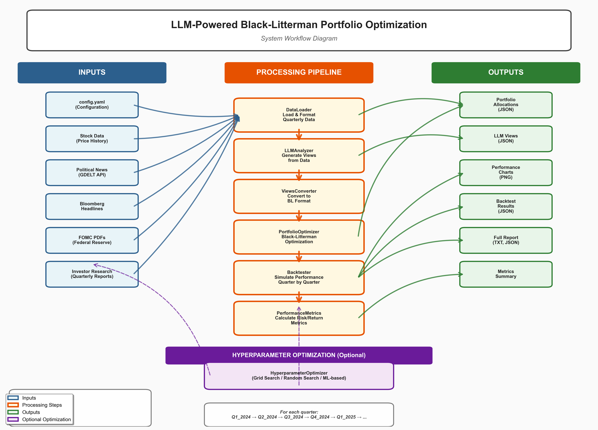
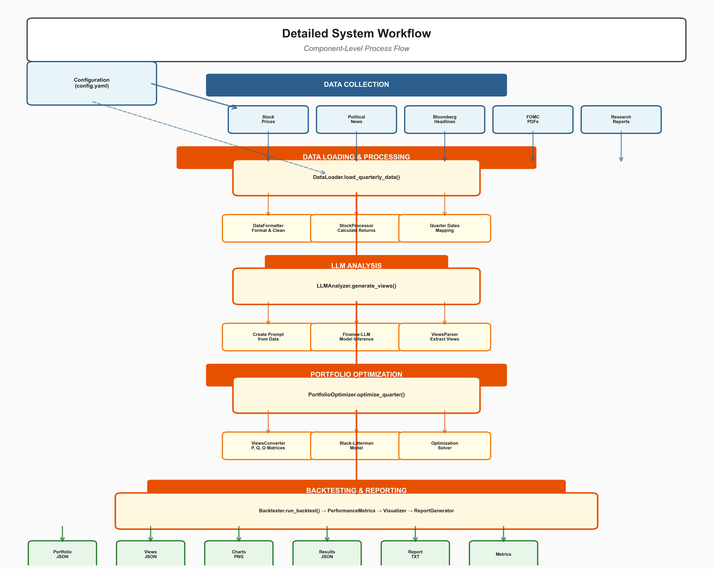

# LLM-Powered Black-Litterman Portfolio Optimization

An advanced portfolio optimization system that leverages Large Language Models (LLMs) to analyze multi-source financial data and generate investment views for Black-Litterman portfolio optimization.

## Overview

This system combines:
- **Multi-Source Data Analysis**: Political news, FOMC minutes, research reports, Bloomberg headlines
- **LLM-Powered Views Generation**: Structured investment views from unstructured data
- **Black-Litterman Optimization**: Risk-aware portfolio construction
- **Quarterly Rebalancing**: Systematic portfolio updates
- **Comprehensive Backtesting**: Performance analysis with benchmarks

## Architecture

### System Workflow

The complete system workflow is visualized in the following diagrams:



**High-Level Overview** (`output/workflow_diagram.png`):
- Shows the complete data flow from inputs through processing to outputs
- Includes hyperparameter optimization loop
- Color-coded by component type (inputs, processes, outputs)



**Detailed Component View** (`output/workflow_diagram_detailed.png`):
- Component-level process flow with sub-processes
- Shows internal processing details for each major step
- Includes method calls and data transformations

For more information about generating and customizing these diagrams, see [WORKFLOW_DIAGRAM_README.md](WORKFLOW_DIAGRAM_README.md).

### Text Flow

```
Data Sources → Data Pipeline → LLM Analysis → Views Matrix → Black-Litterman → Portfolio → Backtesting → Reports
```

### Components

1. **Data Pipeline** (`data/`)
   - `loader.py`: Load all data sources (news, FOMC, research, stock prices)
   - `formatter.py`: Format data for LLM consumption
   - `stock_processor.py`: Process stock data for optimization

2. **LLM Analysis** (`llm/`)
   - `analyzer.py`: Main LLM interface (supports multiple models)
   - `prompts.py`: System and user prompts
   - `views_parser.py`: Parse and validate LLM output

3. **Optimization** (`optimization/`)
   - `portfolio_optimizer.py`: Portfolio optimization wrapper
   - `views_converter.py`: Convert LLM views to P, Q, Ω matrices
   - Uses existing `BlackLitterman/BlackLitterman.py` implementation

4. **Backtesting** (`backtesting/`)
   - `backtester.py`: Simulate portfolio performance
   - `metrics.py`: Calculate performance metrics
   - `visualization.py`: Generate charts

5. **Reporting** (`reports/`)
   - `report_generator.py`: Create comprehensive reports

## Installation

```bash
# Install dependencies
pip install -r requirements.txt

# For local LLM (optional)
pip install transformers torch

# For API-based LLMs (optional)
pip install anthropic  # For Claude
pip install openai     # For GPT-4
```

## Usage

### Quick Start

Run the complete pipeline with default settings (simulated LLM):

```bash
python main.py
```

### Advanced Usage

```bash
# Use AdaptLLM/finance-LLM local model (default)
python main.py --llm-type finance-llm

# Use simulated mode (fallback, for testing)
python main.py --llm-type simulated

# Process specific quarters
python main.py --quarters Q1_2024 Q2_2024 Q3_2024

# Skip chart generation
python main.py --skip-charts
```

### LLM Options

1. **finance-llm** (default): AdaptLLM/finance-LLM local model
   - Local model, no API required
   - Requires `transformers` and `torch` packages
   - Runs locally (GPU recommended, but works on CPU)
   - Financial domain-specific
   - Model downloads automatically on first use (~7GB)

2. **simulated**: Rule-based views generation (fallback only)
   - Used automatically if finance-llm fails to load
   - Fast and deterministic
   - Good for testing/debugging

## Data Sources

The system uses your existing collected data:

- **Political News**: `political_news_data/` (GDELT articles)
- **FOMC Minutes**: `Finance and Investments Group Final Project/FOMC data/`
- **Investment Research**: `Finance and Investments Group Final Project/Investor Research/`
- **Bloomberg Headlines**: `Finance and Investments Group Final Project/Bloomberg Headlines/`
- **Stock Data**: `Finance and Investments Group Final Project/Stock Data.xlsx`

## Target ETFs

- **XLK** - Technology Select Sector SPDR
- **XLY** - Consumer Discretionary Select Sector SPDR
- **ITA** - iShares U.S. Aerospace & Defense ETF
- **XLE** - Energy Select Sector SPDR
- **XLV** - Health Care Select Sector SPDR
- **XLF** - Financial Select Sector SPDR

## Output

After running the pipeline, find results in:

- `output/portfolios/`: Quarterly portfolio allocations (JSON)
- `output/views/`: LLM-generated investment views (JSON)
- `output/charts/`: Performance visualizations (PNG)
- `output/reports/`: Full analysis report (TXT, JSON)
- `output/workflow_diagram.png`: System workflow diagram (high-level)
- `output/workflow_diagram_detailed.png`: Detailed component workflow diagram

## Key Files

### Configuration
- `config.yaml`: System configuration parameters
- `requirements.txt`: Python dependencies

### Main Pipeline
- `main.py`: End-to-end execution pipeline

### Existing BlackLitterman
- `BlackLitterman/BlackLitterman.py`: Core optimization model (existing)

## Methodology

### 1. Data Loading
For each quarter, the system loads:
- Political news articles related to each sector
- FOMC meeting minutes for monetary policy signals
- Quarterly investment research reports
- Bloomberg headlines for market sentiment
- Historical stock prices for covariance calculation

### 2. LLM Analysis
The LLM analyzes all data and generates structured views:
```json
{
  "quarter": "Q1_2024",
  "views": [
    {
      "ticker": "XLK",
      "expected_return": 0.03,
      "confidence": 75,
      "reasoning": "Strong AI momentum..."
    }
  ]
}
```

### 3. Views Matrix Construction
Convert LLM views to Black-Litterman matrices:
- **P**: View specification matrix (absolute views)
- **Q**: Expected returns vector
- **Ω**: View uncertainty matrix (diagonal, based on confidence)

### 4. Black-Litterman Optimization
Combine market equilibrium with LLM views:
- Prior: Implied equilibrium returns from market weights
- Views: LLM-generated expected returns
- Optimization: Maximize Sharpe ratio (long-only)

### 5. Backtesting
Simulate quarterly rebalancing:
- Start with initial capital
- Apply optimized weights each quarter
- Calculate actual returns using historical data
- Compare to equal-weight benchmark

### 6. Performance Analysis
Calculate comprehensive metrics:
- Total and annualized returns
- Sharpe, Sortino, Calmar ratios
- Maximum drawdown
- Value at Risk (VaR)
- Information ratio vs benchmark

## Performance Metrics

The system calculates:

- **Return Metrics**: Total return, annualized return, quarterly returns
- **Risk Metrics**: Volatility, VaR, CVaR, maximum drawdown
- **Risk-Adjusted**: Sharpe ratio, Sortino ratio, Calmar ratio
- **Relative**: Information ratio, outperformance vs benchmark
- **Trading**: Average turnover per quarter

## Visualizations

Generated charts include:
- Cumulative returns (strategy vs benchmark)
- Quarterly returns comparison
- Portfolio allocation heatmap
- Drawdown over time
- Risk-return scatter plot

## Customization

### Adjust Black-Litterman Parameters

Edit `config.yaml`:
```yaml
black_litterman:
  risk_aversion: 2.5      # Higher = more conservative
  tau_for_covariance: 0.025  # Prior uncertainty
  tau_omega: 0.05         # Views uncertainty
```

### Change LLM Prompts

Edit `llm/prompts.py` to customize:
- System prompt (analyst persona)
- User prompt template (data formatting)

### Modify Optimization Constraints

Edit `optimization/portfolio_optimizer.py`:
- Adjust weight bounds
- Add sector constraints
- Modify objective function

### Hyperparameter Optimization

Run hyperparameter optimization to find best settings:

```bash
# Random search (recommended)
python hyperparameter_optimization.py --method random --n-trials 20

# Grid search
python hyperparameter_optimization.py --method grid --max-combinations 50
```

Results are saved to `output/hyperparameter_optimization/` with:
- JSON files with all results and analysis
- Automatic visualization generation

### Visualize Optimization Results

Generate graphs and analysis from optimization results:

```bash
# Visualize latest results
python hyperparameter_visualization.py

# Visualize specific results
python hyperparameter_visualization.py --results-file path/to/results.json --analysis-file path/to/analysis.json
```

Creates visualizations including:
- Hyperparameter importance analysis
- Parameter vs metric relationships
- Correlation heatmaps
- Metric distributions
- 2D hyperparameter spaces
- Pareto frontier (risk vs return)
- Top configurations comparison

## Project Structure

```
project/
├── main.py                     # Main pipeline
├── config.yaml                 # Configuration
├── requirements.txt            # Dependencies
├── README.md                   # This file
│
├── data/                       # Data loading
│   ├── loader.py
│   ├── formatter.py
│   └── stock_processor.py
│
├── llm/                        # LLM analysis
│   ├── analyzer.py
│   ├── prompts.py
│   └── views_parser.py
│
├── optimization/               # Portfolio optimization
│   ├── portfolio_optimizer.py
│   └── views_converter.py
│
├── backtesting/                # Performance analysis
│   ├── backtester.py
│   ├── metrics.py
│   └── visualization.py
│
├── reports/                    # Report generation
│   └── report_generator.py
│
├── BlackLitterman/             # Existing BL implementation
│   ├── BlackLitterman.py
│   └── main.py
│
└── output/                     # Generated results
    ├── portfolios/
    ├── views/
    ├── charts/
    └── reports/
```

## Academic Use

This system was developed for MGT 6078 (Georgia Tech). Key features for academic analysis:

1. **Novel Approach**: First application of LLMs to Black-Litterman optimization
2. **Reproducible**: All code and data sources documented
3. **Comprehensive**: Full pipeline from data to results
4. **Benchmarked**: Rigorous comparison to equal-weight baseline
5. **Transparent**: Clear methodology and limitations discussed

## Limitations

- LLM quality depends on model and prompts
- Historical backtest (not forward-looking)
- Transaction costs not modeled
- Limited to 7 quarters of data
- Assumes quarterly rebalancing optimal

## Future Enhancements

- Real-time data integration
- Alternative view formulations (relative views)
- Transaction cost modeling
- Machine learning for hyperparameter tuning
- Ensemble of multiple LLMs
- Sentiment analysis integration
- Factor models for risk decomposition

## License

Academic/Educational use for MGT 6078 course project.

## Contact

For questions about the system, refer to the code documentation or the comprehensive reports generated in `output/reports/`.

